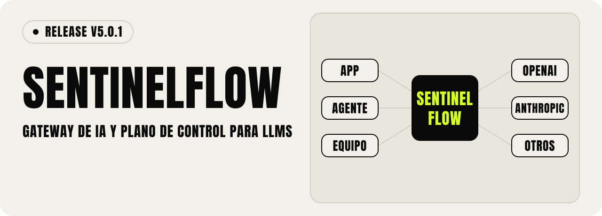
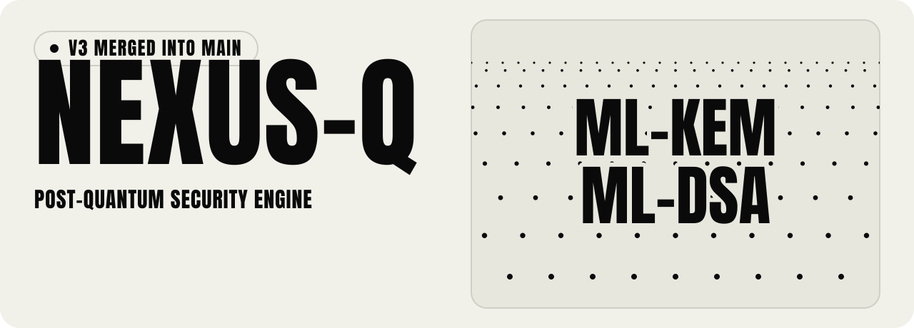
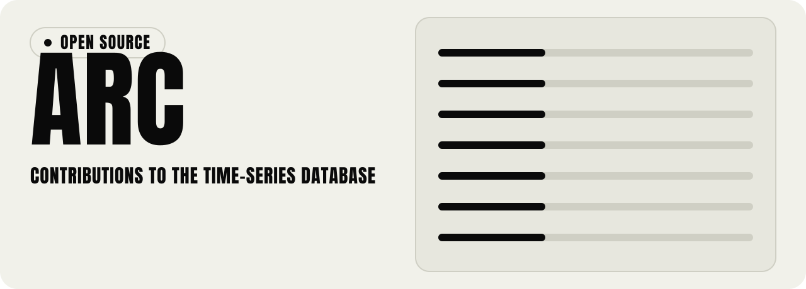
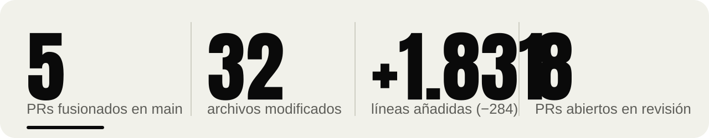

<picture><source media="(prefers-color-scheme: dark)" srcset="assets/dark/hero.svg"></picture>

<a href="https://github.com/lecodev-26?tab=repositories"><picture><source media="(prefers-color-scheme: dark)" srcset="assets/dark/b-repos.svg"></picture></a>&nbsp;<a href="mailto:lecodevv@gmail.com"><picture><source media="(prefers-color-scheme: dark)" srcset="assets/dark/b-mail.svg"></picture></a>&nbsp;<a href="https://github.com/Basekick-Labs/arc/pulls?q=is%3Apr+author%3Alecodev-26+is%3Amerged"><picture><source media="(prefers-color-scheme: dark)" srcset="assets/dark/b-arcprs.svg"></picture></a>

**Ingeniero de software, infraestructura y backend en Barcelona.** Construyo la maquinaria detrás del producto: gateways de IA, criptografía post-cuántica y lenguajes de sistemas.

<picture><source media="(prefers-color-scheme: dark)" srcset="assets/dark/marquee.svg"></picture>

<picture><source media="(prefers-color-scheme: dark)" srcset="assets/dark/h-que.svg"></picture>

Me interesa la capa entre el software y la infraestructura: la parte que hace que los sistemas sean útiles, controlables y resistentes. Prefiero construir la máquina detrás del producto antes que otro envoltorio fino sobre una API.

| Qué hago | Dónde |
|---|---|
| Gateways de IA e infraestructura LLM | SentinelFlow |
| Seguridad y sistemas criptográficos | NEXUS-Q |
| Lenguajes, compiladores y runtimes | AXIOM |
| Agentes, herramientas y MCP | Genie |
| Bases de datos de series temporales | Arc |
| Software local y autoalojado | Linux · Android · Termux |

<picture><source media="(prefers-color-scheme: dark)" srcset="assets/dark/h-proyectos.svg"></picture>

<picture><source media="(prefers-color-scheme: dark)" srcset="assets/dark/r-sentinelflow.svg"></picture>

Gateway compatible con OpenAI para equipos que usan varios proveedores de modelos. Reúne enrutado inteligente, failover entre proveedores, políticas, FinOps de IA, seguridad y observabilidad en una sola capa open source. Autenticación, aislamiento por tenant, cuotas, auditoría y eventos.

`Go` `PostgreSQL` `Redis` `Docker` `Kubernetes` `Prometheus`

<picture><source media="(prefers-color-scheme: dark)" srcset="assets/dark/l-sentinelflow.svg"></picture> 
Go 87% · HTML 9% · Shell 2% · otros 2%

- **Estado:** V5.0.1 estable · V6 en desarrollo en la rama `v6`
- **Licencia:** MIT
- **Última actividad:** 7 oct 2026

<a href="https://github.com/lecodev-26/sentinelflow"><picture><source media="(prefers-color-scheme: dark)" srcset="assets/dark/b-repo.svg"></picture></a>

<picture><source media="(prefers-color-scheme: dark)" srcset="assets/dark/r-nexus-q.svg"></picture>

Infraestructura de seguridad en Rust para proteger datos, claves e identidades: ciclo de vida de claves, cifrado autenticado, credenciales, auditoría, políticas y abstracción de hardware. Se mide con CI de seguridad, benchmarks y un PQC Benchmark Arena frente a otras librerías. Sin auditoría independiente ni certificación.

`Rust` `ML-KEM-768` `ML-DSA-65` `RISC-V` `Android` `SDKs`

<picture><source media="(prefers-color-scheme: dark)" srcset="assets/dark/l-nexus-q.svg"></picture> 
Rust 94% · C 3% · C++ 1% · Go, Shell, PHP, Ruby 2%

- **V1:** base congelada `v1.0.0`
- **V2:** congelada en `nexusqv2` (`v2.0.0`)
- **V3:** integrada en `main` (PR #45)
- **V4:** núcleos de rendimiento por arquitectura (Issue #23)
- **Última actividad:** 9 oct 2026

<a href="https://github.com/lecodev-26/nexus-q"><picture><source media="(prefers-color-scheme: dark)" srcset="assets/dark/b-repo.svg"></picture></a>

<picture><source media="(prefers-color-scheme: dark)" srcset="assets/dark/r-axiom.svg"></picture>

Lenguaje de propósito general con una sintaxis pequeña y un modelo semántico profundo. El objetivo a largo plazo es su propio compilador, runtime, ABI y cadena de herramientas autoalojada, de modo que AXIOM compile AXIOM. Python y Rust son la infraestructura de transición.

`Python` `Rust` `Compilador` `Runtime` `Sistemas`

<picture><source media="(prefers-color-scheme: dark)" srcset="assets/dark/l-axiom.svg"></picture> 
Python 51% · Rust 49%

- **Estado:** arquitectura cerrada, ahora en implementación
- **Licencia:** MIT
- **Última actividad:** 3 oct 2026

<a href="https://github.com/lecodev-26/axiom"><picture><source media="(prefers-color-scheme: dark)" srcset="assets/dark/b-repo.svg"></picture></a>

<picture><source media="(prefers-color-scheme: dark)" srcset="assets/dark/r-genie.svg"></picture>

Un archivo `SKILL.md` con instrucciones para que una IA adivine lo que piensas, sin app ni instalación. Las preguntas se adaptan a tus respuestas, un «no sé» no cuenta como sí ni como no, y solo se arriesga cuando tiene evidencia suficiente. Incluye además un servidor MCP remoto mínimo para clientes de IA compatibles.

`Markdown` `TypeScript` `MCP`

- **Licencia:** MIT
- **Última actividad:** 29 sep 2026

<a href="https://github.com/lecodev-26/genie"><picture><source media="(prefers-color-scheme: dark)" srcset="assets/dark/b-repo.svg"></picture></a>&nbsp;<a href="https://github.com/lecodev-26/genie/releases/latest"><picture><source media="(prefers-color-scheme: dark)" srcset="assets/dark/b-release.svg"></picture></a>

<picture><source media="(prefers-color-scheme: dark)" srcset="assets/dark/r-nuvora.svg"></picture>

Proyecto experimental con backend en Python y una interfaz en JavaScript, desplegado en Vercel. Lo mantengo ligero mientras la implementación evoluciona.

`Python` `JavaScript` `Vercel`

<picture><source media="(prefers-color-scheme: dark)" srcset="assets/dark/l-nuvora.svg"></picture> 
Python 74% · JavaScript 26%

- **Última actividad:** 28 sep 2026

<a href="https://nuvora-chi.vercel.app"><picture><source media="(prefers-color-scheme: dark)" srcset="assets/dark/b-demo.svg"></picture></a>&nbsp;<a href="https://github.com/lecodev-26/nuvora"><picture><source media="(prefers-color-scheme: dark)" srcset="assets/dark/b-repo.svg"></picture></a>

<picture><source media="(prefers-color-scheme: dark)" srcset="assets/dark/r-arc.svg"></picture>

Contribuyo a Arc, de Basekick Labs: una base de datos SQL de series temporales, abierta, hecha en Go sobre DuckDB, para telemetría de alto rendimiento, almacenamiento Parquet y SQL analítico. Tengo 5 PRs fusionados en `main`, con cambios en el WAL, la replicación de archivos, la ingesta y la API de tiering.

`Go` `DuckDB` `WAL` `Parquet` `Ingesta`

- **PRs fusionados en main:** 5
- **Último merge:** 8 oct 2026

<a href="https://github.com/Basekick-Labs/arc"><picture><source media="(prefers-color-scheme: dark)" srcset="assets/dark/b-arc.svg"></picture></a>

<picture><source media="(prefers-color-scheme: dark)" srcset="assets/dark/h-arc.svg"></picture>

Arc (Basekick Labs) es una base de datos SQL de series temporales con licencia AGPL-3.0, escrita en Go, con 681 estrellas. Estos son los cambios míos que el mantenedor ha fusionado en su rama `main`, con el contexto de cada revisión.

<picture><source media="(prefers-color-scheme: dark)" srcset="assets/dark/stats.svg"></picture>

#### [#1073](https://github.com/Basekick-Labs/arc/pull/1073) · `fix(filereplication): make rewritten files immutable`

**Fusionado en main** · 8 oct 2026 · +623 −101 · 16 archivos · Posterior a la 26.09.3 · Cierra #975 · desbloquea #1092

Las reescrituras parciales de un DELETE ya no mutan la entrada existente del manifiesto: publican un Parquet nuevo, registran la nueva ruta y borran la antigua en un único batch de Raft, con el checksum y el tamaño reescritos y el nodo que reescribe como nuevo origen. Antes, una reescritura del mismo tamaño podía dejar a las réplicas confiando en un archivo obsoleto, porque la presencia se comprobaba solo por tamaño. Cubre los caminos en vivo, de replay y de catch-up por snapshot, y serializa los DELETE parciales concurrentes para que no publiquen varios supervivientes del mismo origen. El mantenedor destacó que el enfoque era el correcto desde el primer push. Benchmark sobre datos existentes: +0,26 %, dentro del margen de ruido.

#### [#1051](https://github.com/Basekick-Labs/arc/pull/1051) · `fix(api): validate tiering file limits`

**Fusionado en main** · 7 oct 2026 · +129 −21 · 2 archivos · Posterior a la 26.09.3 · Fixes #1135

`GET /api/v1/tiering/files` rechaza valores de `limit` no enteros o negativos, que antes provocaban un panic al cortar el slice con un índice negativo. Añadí una guarda estructural con límite positivo en el punto de uso, mantuve `limit=0` como resultado vacío explícito y retiré el tope de 1000 propuesto para no cambiar la compatibilidad de la API.

#### [#1055](https://github.com/Basekick-Labs/arc/pull/1055) · `fix(wal): line-protocol WAL entries carry their database envelope`

**Fusionado en main** · 4 oct 2026 (merge 5 oct) · +137 −4 · 3 archivos · Release 26.09.3 · Fixes #889

Las escrituras line-protocol llegaban al buffer como columnas sin los bytes originales del cliente, así que su entrada de WAL salía sin base de datos y un receptor la archivaba siempre en «default». La ruta de formato por filas escribe ahora el mismo sobre que usa msgpack. Es seguro para replay, receptor, checkpoints y tamaños grandes, y legible por cualquier binario desde la 26.05.1. En la revisión el mantenedor recortó el alcance: se descartó el cambio en `cmd/arc/main.go` (#886), que dependía de #888, y se conservó solo el sobre de #889.

#### [#1056](https://github.com/Basekick-Labs/arc/pull/1056) · `fix(wal): purge only data proven flushed`

**Fusionado en main** · 4 oct 2026 · +884 −156 · 8 archivos · Release 26.09.3 · Resuelve #1009 / #966

Cierra el hueco que quedaba en la purga del WAL. Rastrea las identidades pendientes mediante checkpoints de flush duraderos, expone una secuencia mínima sin volcar real y usa `PurgeFlushed` en lugar de la antigüedad por reloj para la limpieza periódica y la de recuperación, de modo que un archivo solo se borra cuando sus datos ya se volcaron. Tras la revisión, un commit del mantenedor acota el suelo de purga y recupera los archivos que no puede describir.

#### [#769](https://github.com/Basekick-Labs/arc/pull/769) · `fix(ingest): log numeric host coercion at debug level`

**Fusionado en main** · 13 sep 2026 · +58 −2 · 3 archivos · Release 26.09.2 · Fixes #768

El respaldo que convierte valores numéricos en cadenas `host_<num>` es intencional y se mantiene, pero ocultaba una señal de clientes mal configurados. Añadí un log a nivel debug cuando se activa, para no saturar la ruta caliente de ingesta, y dos casos de prueba (host float y booleano) que caen en la rama por defecto. Pasó tres rondas de revisión y el merge me añadió a la lista de contribuyentes del proyecto.

#### Abiertos, aún sin merge

Estos 8 PRs siguen en revisión o consolidación. No los cuento como contribuciones fusionadas.

| PR | Título | Estado |
|---|---|---|
| [#1185](https://github.com/Basekick-Labs/arc/pull/1185) | `fix: separate WAL and reconciliation identities` | Abierto · 9 oct |
| [#1074](https://github.com/Basekick-Labs/arc/pull/1074) | `fix(cluster): keep replicated batches out of manifest registration` | Abierto · cierra #888 · un revisor validó los tests con `-race` |
| [#1059](https://github.com/Basekick-Labs/arc/pull/1059) | `feat(wal): apply disk pressure backpressure` | Reabierto por el mantenedor: se consolidará sobre #1115 con atribución a mi trabajo |
| [#1058](https://github.com/Basekick-Labs/arc/pull/1058) | `fix(api): reject invalid execution limits` | Abierto |
| [#1057](https://github.com/Basekick-Labs/arc/pull/1057) | `feat(metrics): expose queued and inflight ingest records` | Abierto |
| [#1054](https://github.com/Basekick-Labs/arc/pull/1054) | `fix(filereplication): verify snapshot catch-up content` | Abierto · verifica SHA-256 en el catch-up |
| [#1053](https://github.com/Basekick-Labs/arc/pull/1053) | `feat(retention): apply policies to cold tier` | Abierto |
| [#1052](https://github.com/Basekick-Labs/arc/pull/1052) | `feat(tiering): support filtered manual migrations` | Abierto · filtros por base de datos y medida |

Fuente: las páginas públicas de los PRs y releases de Arc en GitHub y su API, a 9 de octubre de 2026. Todos los merges los hizo el mantenedor del proyecto. #769 salió en la 26.09.2, #1055 y #1056 en la 26.09.3, y #1051 y #1073 se fusionaron después de la 26.09.3, el último release publicado.

<picture><source media="(prefers-color-scheme: dark)" srcset="assets/dark/h-crono.svg"></picture>

<picture><source media="(prefers-color-scheme: dark)" srcset="assets/dark/timeline.svg"></picture>

<picture><source media="(prefers-color-scheme: dark)" srcset="assets/dark/h-stack.svg"></picture>

<picture><source media="(prefers-color-scheme: dark)" srcset="assets/dark/stack.svg"></picture>

## 🐍 Contribution Snake

<picture><source media="(prefers-color-scheme: dark)" srcset="assets/dark/h-hablemos.svg"></picture>

<a href="mailto:lecodevv@gmail.com"><picture><source media="(prefers-color-scheme: dark)" srcset="assets/dark/b-email2.svg"></picture></a>

lecodev · Barcelona · © 2026

